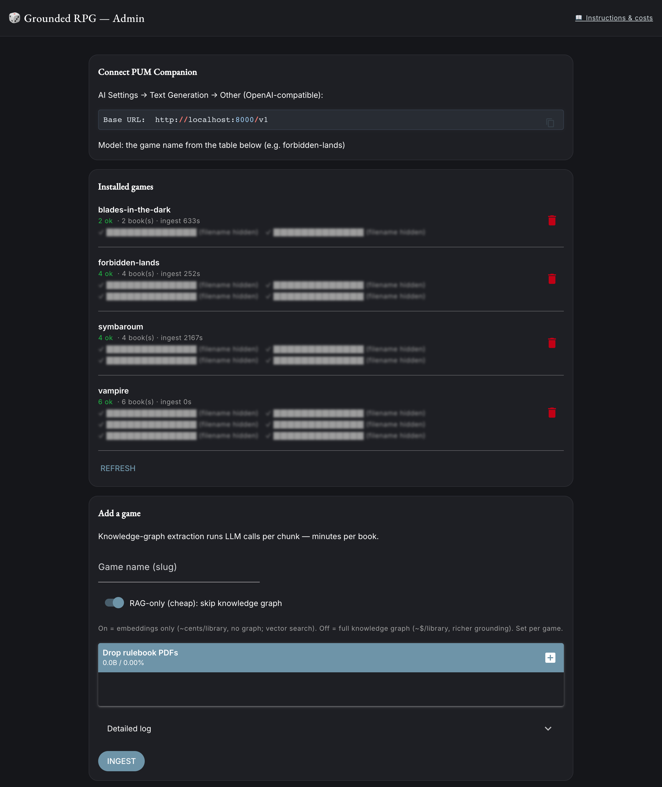

# Grounded RPG Proxy for PUM Companion

Make [PUM Companion](https://jeansenvaars.itch.io/pum-companion)'s AI answer from
*your* RPG rulebooks instead of inventing things. This is a small program you run
on your own computer: PUM talks to it, it looks things up in the books you give it,
and hands back grounded answers — real NPCs, locations, rules and lore from your
actual sourcebooks.

It uses **one free Google Gemini key** by default, and on the free tier **can't
cost you anything**. (Optional upgrades for stronger results are in
[Cost & quality](#cost--quality).)



*The browser dashboard: connect PUM, see your games, and add rulebooks by dropping
in PDFs. (Filenames blurred in this screenshot.)*

---

## Setup (about 5 minutes)

You need **Python 3.10+** and the **PDFs of rulebooks you own**.

**1. Download and install**

```bash
git clone https://github.com/briannewtonpsyd/grounded-rpg-proxy.git
cd grounded-rpg-proxy
./setup.sh
```

`setup.sh` sets everything up for you (creates a private environment, installs what
it needs, makes your config file). It takes a few minutes the first time.

**2. Start it**

```bash
./run.sh
```

This opens the **dashboard** in your browser at `http://localhost:8000/admin`.
Leave this terminal window running — closing it stops the proxy.

**3. Add your free Gemini key**

- Get one (no credit card) at **https://aistudio.google.com/apikey** → *Create API key*.
- In the dashboard: **Settings → Gemini key** → paste it → **Save**.

> 💡 As long as you never turn on billing in Google, this stays **free** — Google
> just slows you down instead of charging. See [Cost & quality](#cost--quality).

**4. Add a game (your rulebooks)**

In the dashboard, under **Add a game**:
- Type a short name (e.g. `forbidden-lands`) — this becomes the "model" you pick in PUM.
- Drag in the rulebook PDFs.
- Click **Ingest** and watch the progress bar. (Scanned/image PDFs are handled
  automatically.) A rulebook takes a few minutes and costs about a penny.

**5. Point PUM at it**

In PUM Companion → **Settings → AI Settings**, set **Text Generation** to:

| Field | Value |
|---|---|
| Provider | **Other (OpenAI-compatible)** |
| Base URL | `http://localhost:8000/v1` |
| Model | your game name (e.g. `forbidden-lands`) |
| API key | anything (it's ignored) |

Leave PUM's **Utility** and **Image** settings as they were.

That's it. PUM's story generation is now grounded in your books. To switch games,
just change the **model** in PUM to another game name.

---

## Cost & quality

Everything that costs money or sharpens results is an optional toggle — the
defaults are the cheap, simple path. **The only cost is per-book when you add a
game** (not when you play). Change these in the dashboard **Settings**.

| Setting | Default (cheap & easy) | Upgrade for quality | What the upgrade buys |
|---|---|---|---|
| **Knowledge graph** | Off — vector search, ~pennies/library | On (`Skip KG` unchecked) — **see cost warning below** | Better at "who/where" and connected questions (which NPC is where, who's allied with whom) |
| **Embeddings** | Gemini (your one key) | OpenAI (needs an OpenAI key too) | Slightly sharper retrieval |
| **Reranking** | Off | Add a free Cohere/Jina key | Tidier ordering of the best passages |
| **OCR for scanned PDFs** | On — only image pages, ~$0.08 per 250-page book | (always on; turn off with `OCR_SCANNED=false`) | Lets you ingest books that have no text layer |

### ⚠️ The knowledge graph costs real money — set a budget first

Building the graph runs an AI model over **every chunk of every book**, so cost
scales with how much you ingest. Rough, measured numbers (per book ≈ 200–300 pages):

| Ingest mode | ~Cost per book | A 4-book library |
|---|---|---|
| **RAG-only (default)** | a few cents | **~$0.10** |
| KG on `gemini-2.5-flash-lite` (default KG model) | ~$1–1.5 | ~$4–6 |
| KG on `gemini-2.5-flash` (higher quality) | ~$6–7 | **~$25–30** |

**It adds up faster than you'd think.** Re-ingesting a book re-charges you, and
during development we ran up **~$26 in a single day** from repeated KG re-ingests.
Before turning the graph on:

1. **Decide if you even need it.** RAG-only grounds answers well for most play; the
   graph mainly helps with relationship/"who-knows-whom" questions.
2. **Set a hard limit.** In **Settings → ingest cost ceiling** (`INGEST_MAX_COST_USD`),
   set a dollar cap — the ingest stops itself before crossing it.
3. **Add a Google budget alert.** In [Google Cloud Billing](https://console.cloud.google.com/billing)
   set a budget + email alert so you're warned regardless of this app.
4. **Watch the real numbers.** Every ingest prints its token count and estimated cost,
   and saves them to `lightrag_data/<game>/ingest_audit.json`. Check it after the first
   book before doing a whole shelf.

> 💡 **Want a guaranteed $0 ceiling?** Keep **billing turned off** on your Gemini key.
> Google then *rate-limits* you instead of charging — the proxy automatically slows
> down and keeps going. KG ingests will be slow on the free tier, but they can never
> cost you anything.

**Costs are your responsibility.** This tool runs on *your* Google/OpenAI API keys
and spends real tokens on *your* account. You alone are responsible for any charges
you incur — please use the free tier, a cost ceiling, and a budget alert as above.
The software is provided **as-is, with no warranty** (see [LICENSE](LICENSE)); the
authors are not liable for API costs or any other damages.

### Advanced: use other models via OpenRouter (optional)

Prefer Claude, GPT, or another model for generation? In the dashboard **Settings**,
open **"OpenRouter — optional"**, set the **Query** (and/or **Ingest**) provider to
`openrouter`, paste one OpenRouter key, and use `vendor/model` ids (e.g.
`anthropic/claude-haiku-4.5`, `openai/gpt-4o-mini`, `google/gemini-2.5-flash`). The
**Test query LLM connection** button confirms a model works before you play (model
slugs change over time — check [openrouter.ai/models](https://openrouter.ai/models)).
Two caveats:

- **OpenRouter has no embeddings or reranking** — you still need a Gemini (free) or
  OpenAI key for embeddings. It only swaps the *generation/extraction* model.
- **Cost ceilings can't price arbitrary OpenRouter models**, so for a knowledge-graph
  ingest on OpenRouter the `INGEST_MAX_COST_USD` cap won't enforce and the estimate
  reads `$0` — the proxy warns you, but watch your OpenRouter dashboard for real spend.
- **A new OpenRouter key has no credit**, so most models return "insufficient credits"
  until you add funds. Some `:free` model ids work without credit (availability varies)
  — the **Test connection** button tells you immediately if a model isn't reachable.

---

## Everyday use

- **Run it:** `./run.sh` (add `--native` for a desktop window instead of a browser tab).
- **Add / remove games:** in the dashboard, or from the terminal:
  ```bash
  .venv/bin/python -m app.ingest --game forbidden-lands path/to/books/   # add or extend
  .venv/bin/python -m app.ingest --list                                  # list games
  .venv/bin/python -m app.ingest --delete forbidden-lands                # remove
  ```
- **Switch the grounded source:** change the **model** in PUM to another game name —
  no restart.

---

## Troubleshooting

- **"No Gemini API key set"** → add your free key in the dashboard (Settings → Gemini
  key → Save), or put `GEMINI_API_KEY=...` in `.env` and restart.
- **Answers seem ungrounded / generic** → make sure PUM's **model** matches a game
  you ingested, and that the game's books actually cover what you're asking. For
  setting-creation steps, PUM may inject its own random prompts — pick a setting that
  matches your books.
- **Ingest is slow or pauses** → on the free tier Google rate-limits you; it backs
  off and continues. For big libraries, enable billing or ingest fewer books at once.
- **A book "failed" to ingest** → re-add just that book (same game name); the proxy
  retries cleanly and reuses anything already done. Image-only PDFs need OCR, which
  is automatic but slower.
- **Where are my keys/data?** → in `.env` (keys) and `lightrag_data/` (indexes),
  both kept on your machine and never shared.
